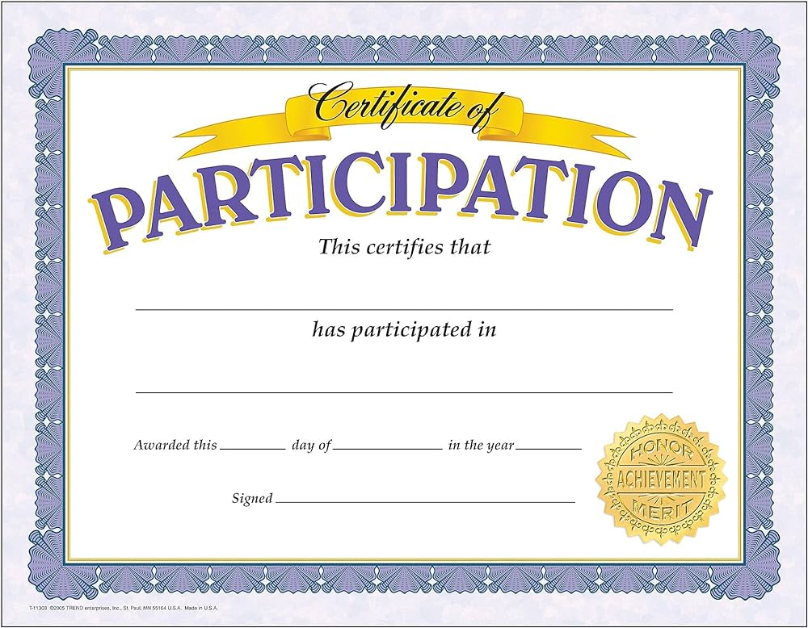

# SmartStudy Pharmacy Courses 🌿💊

Welcome to the SmartStudy Pharmacy Courses repository! This project aims to provide comprehensive online courses tailored to aspiring professionals in the pharmaceutical industry.

## Overview ℹ️

SmartStudy offers a robust platform for individuals looking to enhance their skills and knowledge in pharmacy. Our courses are designed to prepare you for the demands of the pharmaceutical sector through expert-led content and practical learning experiences.

## Technologies Used 🛠️

- **HTML5**: Structure and semantics of web content.
- **CSS3**: Styling and layout design.
- **JavaScript**: Interactive elements and dynamic behavior.

## Screenshot 📸

.png")

## Key Features 🔍

- **Certification**: Industry-recognized certification upon course completion.
- **Comprehensive Content**: Detailed modules covering pharmaceutical concepts and practices.
- **Interactive Learning**: Engaging videos, quizzes, and assignments.
- **Responsive Design**: Optimized for seamless viewing across devices.

## Certificate 📜

## Usage 🚀

Explore our website to enroll in courses, access study materials, and interact with a community of learners and experts. Whether you're starting your career or aiming to advance in the pharmaceutical field, SmartStudy provides the tools and resources you need.

## Customization 🎨

Easily customize the website's content and styles to align with SmartStudy's branding and updates:

- **HTML Structure**: Modify sections to reflect course offerings and updates.
- **CSS Styles**: Adapt colors, fonts, and layouts for a consistent user experience.

## Contributing 🤝

We welcome contributions to enhance the SmartStudy Pharmacy Courses website. Feel free to submit pull requests or open issues to collaborate on improvements, bug fixes, or new features.

## License 📝

This project is licensed under the MIT License. See the LICENSE file for more details.

## Contact 📧

For inquiries or feedback related to the SmartStudy Pharmacy Courses website, please contact Nivethiha Thevarasa at nivethihatheva@gmail.com.
